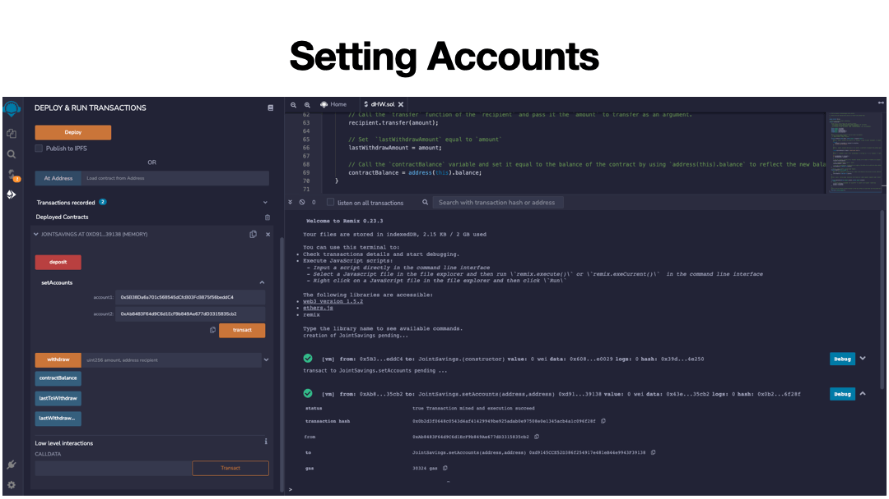

# Crypto-Savings-Account

## Introduction
A Smart contract built with solidity to allow two user accounts to share and manage a joint savings account on the ethereum blockchain. The contract was tested on the [Ethereum Remix IDE](https://remix.ethereum.org/).

## How the contract works
The contract was designed with the following functions:
- withdraw : Allows a user to withdraw funds from the account.
- deposit : Allows a user to deposit funds into the account.
- setAccount : Allows the user to set two to be used as the account owners.

along with the above functions, the contract also has a contract balance which is the sum of the deposits and withdrawals. 

## How to test this contract
Navigate to the [Ethereum Remix IDE](https://remix.ethereum.org/) and create a new solidity file and paste the code below into the editor.

compile and run the contract to test it out. 

## Execution Results

A quick gif showing the varies screenshots of the contract being executed and they can be found here as well for [higher resolution](https://github.com/JQH84/Crypto-Savings-Account/tree/main/Execution_Results)

